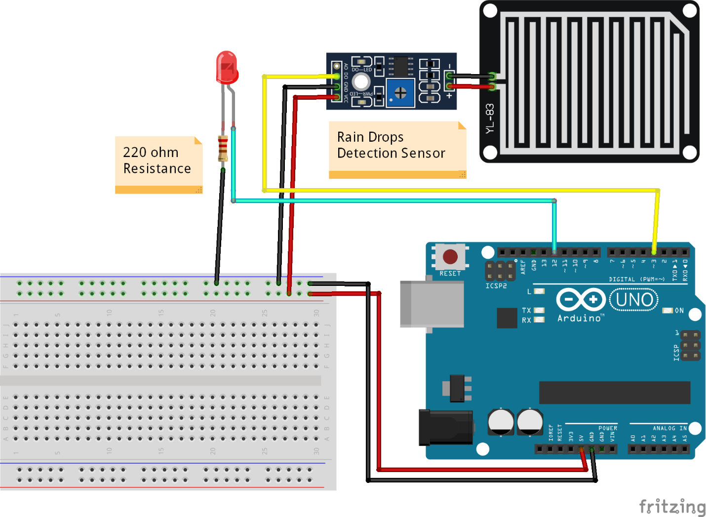
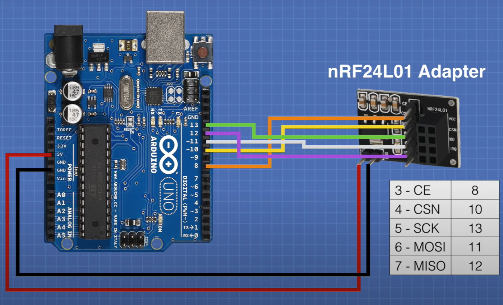

# Rain Sensor and nRF24L01 Module with Arduino

## Description
This project demonstrates the usage of a rain sensor and nRF24L01 communication module with Arduino.
 

    
  </a>
  

   

    
  </a>
  

   
  
## Hardware Components
- Arduino board
- Rain sensor
- NRF24 module

## Usage Instructions

* Download [Arduino](https://support.arduino.cc/hc/en-us/articles/360019833020-Download-and-install-Arduino-IDE)
* Make connections on the Arduino board. This [YouTube videos](https://www.youtube.com/results?search_query=arduino+rain+sensor) can help. 
* Add [this codes](https://github.com/yagmurbarank/rain-sensor-with-arduino/blob/main/Arduino-rain-sensor/Arduino-rain-sensor.ino)
* Create an account on [ThingSpeak](https://thingspeak.com/login?skipSSOCheck=true)
* Add [this code](https://github.com/yagmurbarank/rain-sensor-with-arduino/blob/main/Cloud/Cloud.py) (p.s. you need another Arduino for communication with)

## Pin Configurations

- Rain Sensor Pin: A0
- NRF24 Module CE Pin: 9
- NRF24 Module CSN Pin: 10
- Buzzer Pin: 7

If you need to change pin configurations, locate the corresponding section in the Arduino code and update the pin numbers accordingly.

## License
This project is licensed under the [Your License Name] - see the [LICENSE](LICENSE) file for details.
 

<a href="#readme-top">Back to the Top ↑ </a>
